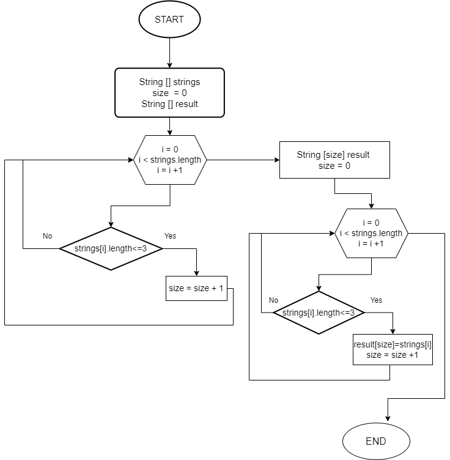

# Описание программы
###  *Программа из имеющегося массива строк формирует новый массив из строк, длина которых меньше, либо равна 3 символам*

В начале программа просит пользователя ввести размер исходного массива строк. \
Затем пользователь вводит каждую строку массива.\
После чего вызывается функция updateStrings, с помощью которой формируется новый массив.\
В конце программа выводит в консоль сформированный массив.\
Функция `updateStrings (String[] strings)` формирует новый массив  ```String[] result```, со строками длиной 3 и менее символов.

```
  int size = 0;
        for (String string : strings) {
            if (string.length() <= 3) {
                size++;
            }
        }
        String[] result = new String[size];
        size = 0;
        for (int i = 0; i < strings.length; i++) {
            if (strings[i].length() <= 3) {
                result[size] = strings[i];
                size++;
            }
        }
        return result;
    }
```

Блок-схема данной функции представлена на следующнй картинке

	
